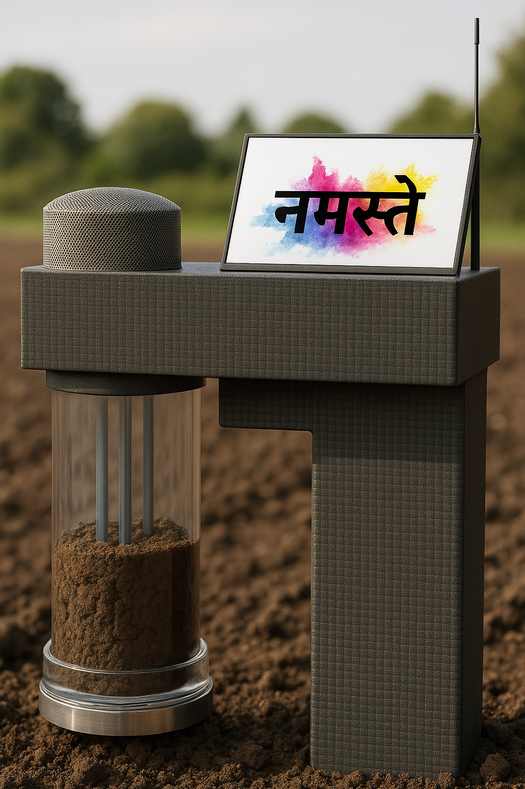

These are the projects which I have worked on till now.  

AIRAVAT 🐘
---
### Artificial Intelligence-based Rapid Analysis of Variability in Atmospheric Trends

Conputer OS 🪲 
---
<ul>
<li>A Debian based personal operating system currently being developed by me with a Green Beetle as it's logo and various system components named after Egyptian and Indian inspirations.</li> 
<li>The name is inspired from an old Chat GPT meme.</li>
</ul>

MRIDA 🌱
---
### Multipurpose Real-time Integrated Digital Analyzer
<ul>
  <li>MRIDA is an AI-powered project designed to help farmers easily check soil health and improve crop yields. </li>
  <li>It was created to measure soil pH, moisture, temperature, and nutrients while also providing weather alerts and also had a built-in emergency service to contact concerned authorities and an speech to speech assistant to guide the user and also give him the insights which they need.</li>
  <li>While the hardware was not developed, the MRIDA app was successfully built using MIT App Inventor and Python to analyze soil conditions and offer useful insights using AI.</li> 
  <li>This project was also presented in:
  <ul>
    <li><strong>Data and AI Talks 2023</strong> - Champion in Group C (Senior) category and was awarded with 9th Gen iPad, Trophy, AI powered Rubik's Cube and Certificates.
    <li><strong>INSPIRE Manak Awards 2023</strong> - I was selected in the first stage and awarded with ₹10000</li> 
    <li><strong>Junior Smart India Hackathon 2023</strong> - Shortlisted for the interview round by the School Innovation Council and Ministry of Education's Innovation Cell.</li>

MRIDA 🌱
---
### Multipurpose Real-time Integrated Digital Analyzer

| Text                                                                                                                   | Image                                                                 |
|------------------------------------------------------------------------------------------------------------------------|-----------------------------------------------------------------------|
| <ul>                                                                                                                   |                               |
| <li>MRIDA is an AI-powered project designed to help farmers easily check soil health and improve crop yields.</li>     |                                                                       |
| <li>It was created to measure soil pH, moisture, temperature, and nutrients while also providing weather alerts and had a built-in emergency service to contact concerned authorities and a speech-to-speech assistant to guide the user and also give them the insights they need.</li> |                                                                       |
| <li>While the hardware was not developed, the MRIDA app was successfully built using MIT App Inventor and Python to analyze soil conditions and offer useful insights using AI.</li> |                                                                       |
| <li>This project was also presented in:                                                                                |                                                                       |
| <ul>                                                                                                                   |                                                                       |
| <li><strong>Data and AI Talks 2023</strong> - Champion in Group C (Senior) category and was awarded with 9th Gen iPad, Trophy, AI-powered Rubik's Cube, and Certificates.</li> |                                                                       |
| <li><strong>INSPIRE Manak Awards 2023</strong> - I was selected in the first stage and awarded with ₹10000.</li>       |                                                                       |
| <li><strong>Junior Smart India Hackathon 2023</strong> - Shortlisted for the interview round by the School Innovation Council and Ministry of Education's Innovation Cell.</li> |                                                                       |
</ul>                                                                                                                    |                                                                       |